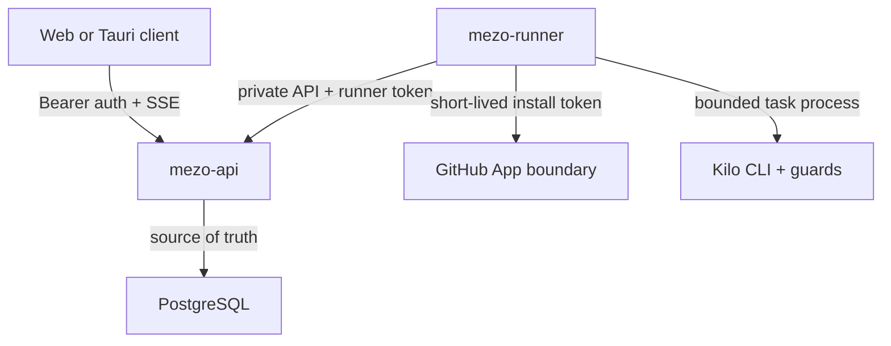

# Architecture

## Production topology

`mezo-api` is the single public backend. It serves the compiled SPA, authentication, repositories, projects, durable tasks and steps, approvals, runner control, provider health/streaming, audit history, and Draft PR orchestration. `mezo-runner` is separate because untrusted repository execution needs a smaller, private network and OS boundary; it exposes no management port.

PostgreSQL is authoritative for users, repository authorization, projects, runners, tasks, steps, events, approvals, provider configuration, settings, and audit records. Local files are not authoritative state. A Fly release command applies transactional, advisory-locked SQL migrations before API rollout.

## Stable API surfaces

| Surface | Representative routes | Authorization |
|---|---|---|
| Authentication | `/api/auth/bootstrap`, `/api/auth/login`, `/api/auth/me` | Bootstrap secret or expiring JWT |
| Users | `/api/users` | Owner |
| Projects and repositories | `/api/projects`, `/api/repositories` | Authenticated; writes owner/operator as defined by route |
| Tasks and evidence | `/api/tasks`, `/api/tasks/{id}`, `/api/tasks/{id}/events` | Owner or task owner |
| Approval and PR | `/api/tasks/{id}/approval`, `/api/tasks/{id}/pull-request` | Owner/operator with task access |
| Runner control | `/api/runners/register`, `/api/runner/*` | Registration token, then hashed runner bearer token |
| Providers | `/api/providers/health`, `/api/providers/generate`, `/api/providers/{name}` | Authenticated; configuration owner-only |
| Audit and emergency control | `/api/audit`, `/api/admin/kill-switch/*` | Authenticated; mutations owner-only |

Pydantic schemas reject malformed roles, refs, event sizes, changed-file paths, and commit SHAs. Invalid task and step transitions return HTTP 409.

## Task execution

1. The API creates a task and nine durable steps in one transaction.
2. A runner leases one queued task with `FOR UPDATE SKIP LOCKED`; expired leases are returned to the queue.
3. The runner creates `/workspaces/<user-id>/<task-id>`, clones only the authorized repository, reads instructions, and asks Kilo for a read-only plan.
4. Kilo implements under a deny-by-default permission file and low-privilege OS identity.
5. Repository checks, the clean-code guard, and conditional test/docs guards run. Failed checks terminate the task.
6. The runner commits locally, calculates the unified diff, diff hash input, file stats, and commit SHA. The API creates a durable approval request.
7. After a user approves the exact diff and separately requests publishing, the runner obtains a short-lived installation token and performs a non-force branch push.
8. The API verifies GitHub’s branch SHA equals the approved commit, then calls GitHub’s Draft PR endpoint. It stores only a URL GitHub actually returned.

## Provider layer

Gemini and an OpenAI-compatible local endpoint implement health, model/capability reporting, native system instructions, streaming, real usage passthrough, timeouts, rate-limit mapping, and explicit/automatic routing. Database configuration determines model, endpoint, enabled state, and priority. Automatic fallback occurs only before output is emitted; a partially streamed failure is surfaced instead of mixing providers or claiming success.

## Frontend

The three-panel React interface uses only API-returned state. It renders durable steps, runner ownership/offline state, SSE command events, file changes, unified diff, validation and guard results, exact-diff approval, audit integrity, failure state, and the real Draft PR URL. No CPU, RAM, queue, model, test, or token values are synthesized.

## Scaling constraints

The queue and leases support multiple runners, but Phase 1 configures one privileged task per runner. Each additional Fly Machine needs its own volume and runner identity. PostgreSQL and GitHub are shared services; runner disks are never assumed shared. Browser automation, model workers, and observability backends are intentionally future services, not fake Phase 1 endpoints.
